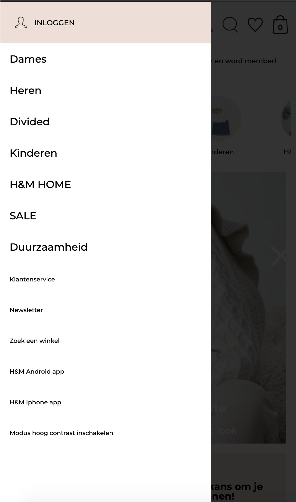
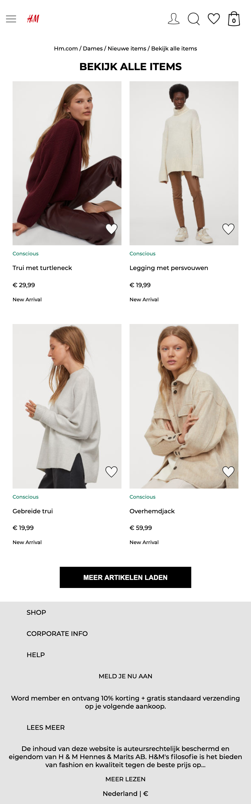

# Procesverslag
**Auteur:** Iris Jansen

Markdown cheat cheet: [Hulp bij het schrijven van Markdown](https://github.com/adam-p/markdown-here/wiki/Markdown-Cheatsheet). Nb. de standaardstructuur en de spartaanse opmaak zijn helemaal prima. Het gaat om de inhoud van je procesverslag. Besteedt de tijd voor pracht en praal aan je website.

## Bronnenlijst
1. https://css-tricks.com/
2. https://www2.hm.com/nl_nl/index.html
3. https://csspeeper.com (Om de headings mee te checken)
4. Medestudenten Ysabella en Ravi

## Eindgesprek (week 7/8)

Ik vond dit vak erg moeilijk aan het begin en had mezelf mede daardoor op de blauwe piste geplaatst. Ik vond het vorig jaar namelijk erg lastig en had dus niet al te hoge verwachtingen van mezelf. Nu ik dit vak bijna heb afgerond kan ik absoluut zeggen dat ik mega veel geleerd hebt en echt niet zo laag over mezelf hoef te denken.

Door alle hulp vanuit de docenten, student-assistenten en klasgenoten ben ik erg ver gekomen en heb ik een website gemaakt waarvan ik 7 weken niet had gedacht dat dat zou kunnen lukken.

Wat goed ging:
 - nagaan wanneer er een a of een button gebruikt moest worden
 - headings toevoegen op plekken die een heading nodig hadden
 - het niet gebruiken van classes maar nth-of-type etc. (hier moest ik wel even inkomen)

Wat ik lastig vond:
 - mijn hamburgermenu maken met JavaScript en daarna nog vormgeven, uiteindelijk gelukt
 - het gebruik van flexbox
 - keuze tussen responsive of surfaceplane
 - het maken van de huiswerkopdrachten naast het maken van mijn website, in de eerste weken gelukt daarna eigenlijk nauwelijks meer.
 - het responsive maken van mijn website

**Screenshot(s):**

Hamburgermenu

Productpagina met hover over afbeeldingen

Op desktop geen hamburgermenu maar menubalk

Scrollen door de trending right now op mobiel

Footer vormgeving

## Voortgang 3 (week 6)

### Stand van zaken
 
Wat ging er minder goed?
- mijn hamburgermenu vormgeven

Wat ging er goed?
-  het maken van linkjes en buttons van elementen die ook linkjes of buttons zijn
- het maken van het wegklikken van mijn hamburgermenu zondeer button

**Screenshot(s):**

### Agenda voor meeting

Individuele vragen
- de afbeelding van het kruis valt weg in de achtergrond hoe los ik dat op?
- wat moet ik doen als ik me op de responsive plane ga focussen?

Groep vragen
- toelichting mediaqueries
- toegankelijkheid in safari (ravi)

### Verslag van meeting

- mijn headings bekeken of die goed genoeg waren
- uitleg gehad over de svg animatie, joost gaf aan dat ik dat misschien wel kon gaan doen (twijfel nog wel)
- ondertussen lijstje gemaakt met dingen die ik nog wil/moet doen

## Voortgang 2 (week 5)

### Stand van zaken
 
Wat ging er minder goed?
- mijn hamburgermenu vormgeven, kwam ik ook nog niet helemaal uit dus die heb ik maar even gelaten
- productpagina, de teksten eronder vormgeven
- foto's worden vaak onscherp bij mij - is dat erg?

Wat ging er goed?
- eerste pagina is zo goed als af, nog werken aan responsive maken
- begonnen aan tweede pagina, niet zo moeilijk als ik dacht

**Screenshot(s):**

### Agenda voor meeting
- meer toelichting over onzichtbare headings
- JS carrousel toelichting
- blok boven nav in header of niet (ravi)

### Verslag van meeting

We hebben iedereens website besproken en wat feedback gekregen. Ik had niet heel veel feedback, ik moest vooral echt linkjes en buttons gaan maken van afbeeldingen die dat zijn.

## Voortgang 1 (week 3)

### Stand van zaken
 
Wat ging er minder goed?

-lastig om de teksten op een afbeelding te positioneren
-lastig om met 'nth of type' te werken, ben classes zo gewend 

Wat ging er goed?

-niet iets specifieks, ik vond het al goed gaan als iets werkt

**Screenshot(s):**

### Agenda voor meeting
- dingen naast elkaar zetten. Op mobiel bijvoorbeeld 2 en desktop 4
- Hoe kun je makkelijker zien nth gebeuren
- Mag je classes  gebruiken
- Mag je classes  gebruiken
- Moet je hamburger laten werken? 
- Hoe zet je het om in een hamburgermenu
- flexbox vragen, naast elkaar zetten bijvoorbeeld.

### Verslag van meeting

Joost heeft van alles uitgelegd en toegelicht, daardoor is veel opgehelderd. Ook heeft hij van een aantal dingen gezegd dat ik dat moest aanpassen. Hier werd ik een beetje verdrietig van maar nadat het toch was gelukt, was ik weer blij.

## Intake (week 1)

**Je startniveau:** De blauwe piste

**Je focus:** Responsive

**Je opdracht:** https://www2.hm.com/nl_nl/index.html

**Screenshot(s):**

**Breakdown-schets(en):**

